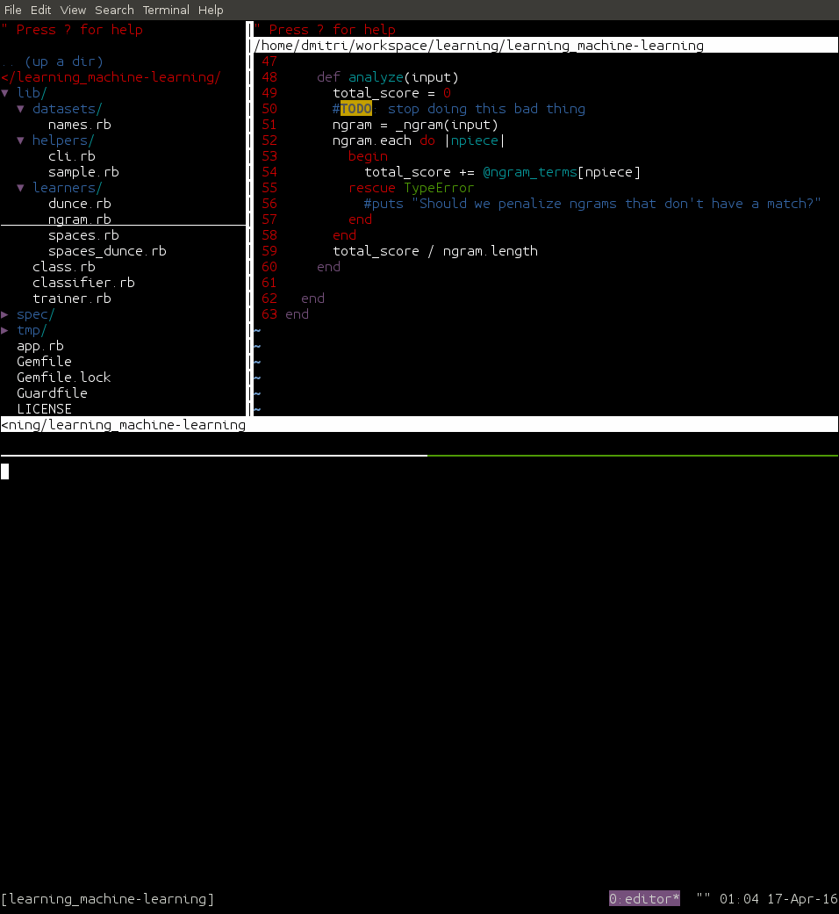

# purpose
Learning machine learning with Ruby one failing spec at a time.

# running
Running an NGram learner with the dataset of names use the following command.
```sh
  ruby run.rb --learner=ngram --dataset=names
```



# obviously data
machine learning heavily depends on the data that you provide.

Even the simplest case of a spaces learner if you provide data that
classifies "abced asdf" as a 0.0 relevance then "Bob Hope" would also be 0.0
relevance.

In cases of using the ngram learner you should play around to see how the data
you provide when you interact with the learner by running it (see: running)


